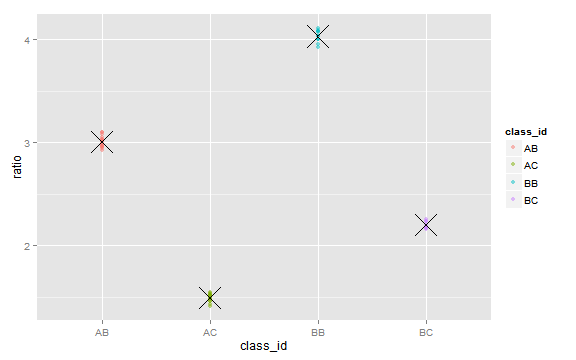

## The problem
 - This particular system maintains data for 'nodes' and management of the capacity is a challenge. There can be 100s to 10,000s of nodes producing data. 
 - Predicting what the effect of adding more nodes to the system is a time consumming process. 
 
## The theory
- It is proposed that nodes belonging a certain class will have similar ratios and therefore it should be possible to determine the class predicted ratio from the collection of observed ratios within the class.

## The potential result
- The class predicted ratio can then be used to predict the effect on system capacity when adding nodes of the same class.
- This simplifies the capacity planning effort by automating the modeling the nodes within a class.

---
## Using R and Shiny a demo was quickly built

- The application simulates data that can be collected from the data management systems.
- The simulated data contains node data collected over 3 intervals
- The simulated data assumes that there is a correlation between the class of the node and the ratio parameter for the node.
- The application allows for the adjustment of the number classes and the number of nodes.
- The application then uses the data to predict what the node ratio parameter would be for a given class.

---

## The simulated data

- The following is a sample of what the simulated data would look like. The data collected from the data management systems would be structured the same way.


```
##    node_id class_id  sample1  sample2  sample3    ratio
## 1       D1       AC 1.551656 1.505820 1.522404 1.526627
## 2       A2       AC 1.453785 1.541773 1.440059 1.478539
## 3       J3       AA 2.480245 2.555586 2.527513 2.521114
## 4       J4       BB 3.962999 3.982526 3.963394 3.969640
## 5       B5       BB 4.048059 4.013969 3.958515 4.006848
## 6       C6       BC 2.160551 2.246669 2.203668 2.203629
## 7       C7       AC 1.463864 1.504574 1.488219 1.485552
## 8       A8       AC 1.509418 1.452675 1.508332 1.490142
## 9       I9       BC 2.165909 2.188008 2.233187 2.195701
## 10     G10       BB 3.950622 4.055214 3.971529 3.992455
```

---
## The class ratio parameter prediction

- The following is a sample of what a plot of the simulated data with class predicted ratios would look like.

 

---
## Next steps

- Review the demostration application.
- Begin the collection process of actual data.
- Adjust the application code to process the collected data.
- Review the results to see if there an actual correlation between the class and the node ratio parameter.
- If there is a correlation: Adjust the application to add a feature to add a number of nodes of a certain class and show the effect on capacity
- If there is no correlation: Review the results and see if there are other parameters contributing to the node ratio.
        
